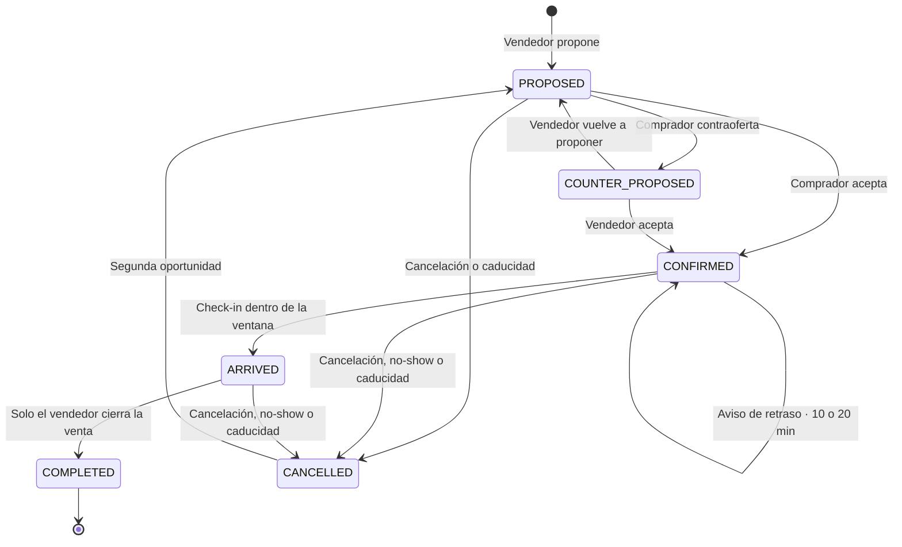

<h1 align="center">Wallapop Meet</h1>

<p align="center">
  <strong>Un concepto de producto: convertir un acuerdo de chat en un encuentro presencial con reglas.</strong><br>
  Caso de estudio, design system y prototipo funcional — no un producto real.
</p>

<p align="center">
  <a href="https://github.com/jm-fuster/wallapop-meet/actions/workflows/ci.yml"></a>
  
  
  
  <a href="LICENSE"></a>
</p>

<p align="center">
  <a href="https://www.figma.com/community/file/1678855760007300709"><strong>Archivo en Figma Community</strong></a>
  ·
  <a href="https://www.figma.com/design/SV6DFkzoEbfCtGnj2xZtgt/Wallapop-Meet-%C2%B7-Case-Study---Concept-Design-System?node-id=50-6878"><strong>Caso de estudio</strong></a>
  ·
  <a href="https://www.figma.com/design/SV6DFkzoEbfCtGnj2xZtgt/Wallapop-Meet-%C2%B7-Case-Study---Concept-Design-System?node-id=50-6882"><strong>Prototipo navegable</strong></a>
  ·
  <a href="#puesta-en-marcha"><strong>Ejecutar en local</strong></a>
</p>

> [!IMPORTANT]
> **Proyecto no oficial, sin afiliación con Wallapop.**
>
> Este repositorio es un **ejercicio de diseño de producto independiente**, hecho por
> iniciativa propia como pieza de portfolio. No está afiliado, patrocinado ni respaldado
> por Wallapop S.L., no ha sido encargado ni revisado por la empresa, y no describe
> ninguna funcionalidad real, planificada ni interna del producto Wallapop.
>
> «Wallapop» y el resto de marcas citadas pertenecen a sus respectivos titulares y se
> usan aquí únicamente para identificar el contexto del ejercicio. El código y la
> documentación son míos y se publican bajo licencia MIT (ver [LICENSE](LICENSE)); esa
> licencia cubre el código, no concede ningún derecho sobre marcas de terceros (ver [NOTICE](NOTICE)).
>
> No contiene datos reales de personas ni de usuarios de ninguna plataforma.

---

## Qué es esto

Un acuerdo cerrado por chat («mañana a las seis en Plaza de España») no existe en ninguna parte del producto: no tiene estado, no tiene dueño y no deja rastro. Cuando falla —un olvido, un cambio de última hora, alguien que no aparece— no hay nada que consultar ni nada que valorar.

**Wallapop Meet** convierte ese acuerdo en un objeto con seis estados, un único responsable por acción y cuatro ventanas temporales, que vive dentro de la conversación de la que nació. El ejercicio se plantea sobre Wallapop como caso de estudio por ser el contexto de compraventa entre particulares más reconocible en España.

### Y qué no es

Esto es lo más importante que hay que entender antes de mirar nada:

| Esto **sí** es | Esto **no** es |
| --- | --- |
| Un caso de estudio de diseño de producto | Una funcionalidad real, planificada o interna de Wallapop |
| Un design system completo, con tokens, componentes y gobernanza | Una librería pensada para instalarse en producción |
| Un prototipo navegable en Figma: 46 pantallas conectadas | Una app publicada, con usuarios o con datos reales |
| Una implementación en React de las reglas de negocio, con tests | Un backend, una cuenta, un pago o una geolocalización de verdad |

> [!NOTE]
> Citando la propia página del prototipo en Figma: *«A prototype is a demonstration, not the product»*. No se simulan la escritura de texto, el desplazamiento del mapa, la navegación del calendario ni la validación de formularios. Cada pantalla muestra **un estado comprometido** del flujo. Las reglas que gobiernan esas interacciones están escritas —y en este repositorio, implementadas y testeadas—, pero el prototipo enseña la forma del recorrido, no el producto.

---

## El flujo

El recorrido completo son **cuatro momentos, todos dentro de la misma conversación**. Sin bandeja nueva y sin sección aparte: la quedada aparece como una tarjeta de sistema en el hilo al que pertenece.

| | Momento | Qué pasa |
| --- | --- | --- |
| **01** | **Proponer** | Una hoja de tres pasos sobre el chat: fecha y hora, punto de encuentro, preferencia de pago. Cada paso se desbloquea al completar el anterior, y el de punto de encuentro sugiere lugares públicos con historial de ventas cerradas. |
| **02** | **Acordar** | La propuesta aterriza en el hilo como una tarjeta con estado en vivo. Aceptar reserva el artículo automáticamente; una contraoferta **sustituye** la tarjeta en lugar de apilar una segunda, así que el hilo sostiene siempre un único acuerdo. |
| **03** | **Llegar** | Dentro de la ventana de llegada, cualquiera de los dos hace check-in desde la tarjeta. Si el pago acordado es Wallet, el comprador muestra un QR que el vendedor escanea — que es además lo que convierte «nos hemos visto» en un evento registrado. |
| **04** | **Valorar** | Después del encuentro, el hilo pregunta si la venta ocurrió. Esa respuesta alimenta la señal de fiabilidad que verá la siguiente persona antes de aceptar una quedada, que es lo que da mordida a las reglas de no-show. |

### La máquina de estados

Seis estados y solo movimientos legales entre ellos. Cualquier transición que no esté dibujada aquí, el dominio la rechaza:



`COMPLETED` es el único estado terminal que significa que la transacción ocurrió. `CANCELLED` guarda siempre un motivo explícito: `MANUAL_CANCEL`, `COUNTER_REPLACED`, `NO_SHOW_BUYER`, `NO_SHOW_FINAL_CONTRADICTION`, `PROPOSAL_EXPIRED` o `MEETUP_EXPIRED`.

### Quién puede hacer qué

La asimetría es deliberada: el vendedor tiene el artículo y la franja, así que abre el flujo y lo cierra; el comprador responde. Quitar de en medio la pregunta «¿quién va primero?» es buena parte del valor.

| | `SELLER` | `BUYER` |
| --- | :---: | :---: |
| Abrir el flujo (inicial, tras contraoferta, tras cancelación) | ✅ | ❌ |
| Aceptar desde `PROPOSED` | ❌ | ✅ |
| Aceptar desde `COUNTER_PROPOSED` | ✅ | ❌ |
| Contraofertar | ❌ | ✅ |
| Marcar llegada (dentro de la ventana) | ✅ | ✅ |
| Cerrar la venta desde `ARRIVED` | ✅ | ❌ |
| Reportar no-show (solo si hizo check-in) | ✅ | ❌ |
| Cancelar donde el estado lo permite | ✅ | ✅ |

La única acción sin dueño es la caducidad: la dispara el tiempo, y no tiene que hacerlo ninguno de los dos.

### Las cuatro reglas temporales

| Ventana | Regla |
| --- | --- |
| **−30 min / +2 h** | **Ventana de llegada.** El check-in solo existe desde 30 minutos antes hasta 2 horas después de la hora acordada. Fuera de ese rango la acción no existe, así que una llegada no se puede falsear el día antes ni registrar a la mañana siguiente. |
| **+5 min** | **Cortesía de no-show.** No se puede reportar hasta 5 minutos pasada la hora, y solo por alguien que hizo check-in. Elimina casi todos los falsos positivos por tráfico, aparcamiento o un ascensor lento. |
| **Últimos 30 min** | **Cancelación tardía.** Sigue permitida, pero se registra. Pasada la hora acordada pesa más, porque la otra persona ya está en el punto de encuentro. Solo se exime la propuesta sustituida por una contraoferta. |
| **Su propio tiempo** | **Caducidad.** Nada queda abierto para siempre. Una propuesta sin responder caduca a la hora que proponía; una quedada confirmada o con llegada caduca al cerrarse la ventana. Caducar no reparte culpa: para eso está el no-show. |

---

## El caso de estudio en Figma

El archivo de Figma es la pieza principal del ejercicio; este repositorio es la implementación de sus reglas. Está escrito en inglés, con una excepción deliberada: **la UI del producto se queda en español**, porque es el mercado al que serviría y porque cada string en Figma es el que el producto muestra de verdad.

Está publicado en **[Figma Community](https://www.figma.com/community/file/1678855760007300709)** bajo CC BY 4.0, así que se puede duplicar y abrir por dentro: las 349 variables, los 39 componentes y el prototipo completo. Los enlaces de la tabla llevan a cada página del archivo original.

| Página | Qué contiene |
| --- | --- |
| [**Start here**](https://www.figma.com/design/SV6DFkzoEbfCtGnj2xZtgt/Wallapop-Meet-%C2%B7-Case-Study---Concept-Design-System?node-id=50-6878) | Cómo leer el archivo, las cifras y el disclaimer. |
| [**The problem**](https://www.figma.com/design/SV6DFkzoEbfCtGnj2xZtgt/Wallapop-Meet-%C2%B7-Case-Study---Concept-Design-System?node-id=50-6879) | Por qué falla un acuerdo cerrado en chat, quién lo paga y la apuesta que hace el concepto. |
| [**The process**](https://www.figma.com/design/SV6DFkzoEbfCtGnj2xZtgt/Wallapop-Meet-%C2%B7-Case-Study---Concept-Design-System?node-id=50-6880) | Siete etapas en el orden en que ocurrieron, y los cinco defectos reales que montar las pantallas dejó al descubierto. |
| [**The solution**](https://www.figma.com/design/SV6DFkzoEbfCtGnj2xZtgt/Wallapop-Meet-%C2%B7-Case-Study---Concept-Design-System?node-id=50-6881) | El mapa completo: seis estados, cada movimiento legal, un dueño por acción y las cuatro ventanas temporales. |
| [**Prototype & screens**](https://www.figma.com/design/SV6DFkzoEbfCtGnj2xZtgt/Wallapop-Meet-%C2%B7-Case-Study---Concept-Design-System?node-id=50-6882) | Las 46 pantallas y el recorrido de punta a punta, en ambos modos de color — con la lista honesta de lo que no simula. |
| [**Design system**](https://www.figma.com/design/SV6DFkzoEbfCtGnj2xZtgt/Wallapop-Meet-%C2%B7-Case-Study---Concept-Design-System?node-id=50-6883) | Catálogos de tokens, specs de componentes, findings, changelog y notas de handoff. |

<table>
<tr>
<td align="center"><strong>46</strong><br>pantallas</td>
<td align="center"><strong>39</strong><br>componentes</td>
<td align="center"><strong>349</strong><br>variables</td>
<td align="center"><strong>46</strong><br>conexiones de prototipo</td>
</tr>
</table>

El prototipo tiene cuatro puntos de entrada: recorrido completo en móvil claro, móvil oscuro, tablet y escritorio. Solo un paso avanza solo —«Propuesta enviada», a los 2,2 s, para representar al comprador aceptando—; todo lo demás espera un clic.

> Dibujar el mapa de estados destapó cinco huecos en las reglas que la prosa había escondido: nada caducaba, no se podía avisar de un retraso una vez alguien había llegado, cancelar después de la hora salía gratis, un vendedor podía reportar un no-show sin haberse presentado, y un vendedor que ya había llegado no podía cancelar — de modo que la única salida que le ofrecía el producto era acusar al comprador de no aparecer. Los cinco están corregidos, en Figma y en este repositorio.

---

## Qué hay en este repositorio

La implementación en React de las reglas de arriba, más el design system que las viste.

```
src/meetup/              Dominio: tipos, máquina de estados, ventana de llegada, QR de Wallet
src/components/meetup/   Componentes y reglas de UI del flujo
src/components/ui/       Design system: átomos y moléculas
src/pages/               Visor del design system (ruta /design-system)
tests/                   Reglas de dominio y de UI
docs/                    Objetivos de producto y user flow funcional
plans/design-system/     Contrato y especificaciones del DS
styles.json              Fuente canónica de tokens
```

**Stack:** React 19 · TypeScript · Vite · Tailwind CSS v4 · Storybook · Convex · Vitest

La app incluye un **visor del design system** en `/design-system` que consume `styles.json` y documenta foundations y componentes sobre el producto real, no sobre una página aparte.

---

## Puesta en marcha

```bash
npm install
npm run dev
```

No hace falta configurar nada: el flujo completo de quedada funciona en memoria con datos de ejemplo.

<details>
<summary><strong>Variables de entorno (opcional)</strong></summary>

<br>

Convex solo se usa para persistir mensajes y quedadas entre recargas. Si no configuras nada, `getConvexHttpClient()` devuelve `null` y la app sigue funcionando sin persistencia.

Para habilitarla, copia el fichero de ejemplo y rellena los valores de tu propio despliegue:

```bash
cp .env.example .env.local
npx convex dev
```

| Variable | Uso |
| --- | --- |
| `CONVEX_DEPLOYMENT` | Despliegue que usa `npx convex dev`. |
| `VITE_CONVEX_URL` | Endpoint que consume el cliente (`src/lib/convex-client.ts`). |
| `VITE_CONVEX_SITE_URL` | HTTP actions del mismo despliegue. |

`.env.local` está ignorado por git; no se publica ninguna credencial en este repositorio.

</details>

<details>
<summary><strong>Scripts disponibles</strong></summary>

<br>

| Script | Qué hace |
| --- | --- |
| `npm run dev` | Arranca el entorno local. |
| `npm run build` | Compila TypeScript y build de Vite. |
| `npm run preview` | Sirve el build de producción en local. |
| `npm test` | Ejecuta las pruebas con Vitest. |
| `npm run storybook` | Levanta Storybook. |
| `npm run build-storybook` | Genera el build estático de Storybook. |
| `npm run ds:sync` | Sincroniza el catálogo del Design System. |
| `npm run ds:check` | Valida la sincronización DS (componentes/stories/tokens). |
| `npm run audit:design-system` | Detecta hardcodes visuales prohibidos en `src`. |
| `npm run audit:design-system:baseline` | Actualiza el baseline del auditor DS. |
| `npm run lint` | Auditoría DS + validación + ESLint. |

</details>

---

## Calidad

El gate obligatorio antes de cerrar cualquier cambio. Los tres primeros son los que ejecuta CI en cada push y cada pull request:

```bash
npm run lint    # auditoría DS + ds:check + ESLint
npm test
npm run build
npx convex dev --once    # solo si el cambio toca convex/
```

La suite cubre, entre otros casos:

- Transiciones válidas e inválidas por estado y rol.
- Ventana de llegada y sus límites exactos.
- No-show con la cortesía mínima de 5 minutos, y la contradicción cuando el comprador sí había hecho check-in.
- Impacto de fiabilidad al cancelar en zona roja.
- Reapertura del flujo tras `CANCELLED` por parte del vendedor.

Además del gate, el repositorio se defiende de la deriva visual: `audit:design-system` falla si aparece un color, un espaciado o un tamaño a fuego en `src`, y `ds:check` falla si un componente del DS se queda sin story o sin entrada en el catálogo.

---

## Documentación

| Documento | Contenido |
| --- | --- |
| [`docs/objectives.md`](docs/objectives.md) | Objetivos de producto y reglas de negocio. |
| [`docs/wallapop-meet-user-flow.md`](docs/wallapop-meet-user-flow.md) | User flow funcional. |
| [`DESIGN_SYSTEM.md`](DESIGN_SYSTEM.md) | Contrato de gobernanza del Design System. |
| [`plans/design-system/design-tokens-v1.md`](plans/design-system/design-tokens-v1.md) | Tokens. |
| [`plans/design-system/components-spec-v1.md`](plans/design-system/components-spec-v1.md) | Especificación de componentes. |
| [`plans/design-system/meetup-ui-patterns-v1.md`](plans/design-system/meetup-ui-patterns-v1.md) | Patrones de UI del flujo. |
| [`plans/design-system/accessibility-qa-checklist.md`](plans/design-system/accessibility-qa-checklist.md) | Checklist de QA y accesibilidad. |

---

## Convenciones

- Los estados de la máquina se mantienen exactamente como están definidos (`PROPOSED`, `CONFIRMED`, …).
- Nada de hardcodes visuales en `src`: siempre tokens.
- Todo cambio de UI se apoya en componentes reutilizables del Design System.
- El subject de los commits va en inglés.

---

<p align="center">
  <sub>Hecho por <a href="https://github.com/jm-fuster">Jorge Molina Fuster</a> · Código y documentación bajo <a href="LICENSE">MIT</a> · <a href="NOTICE">Aviso de marcas</a></sub>
</p>
