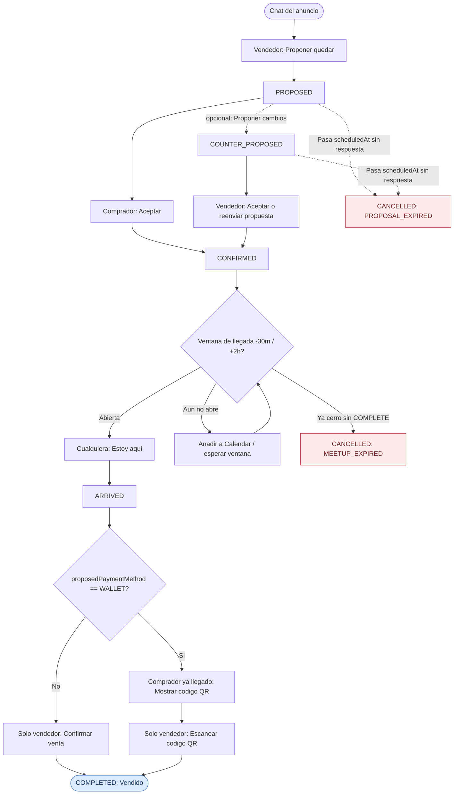
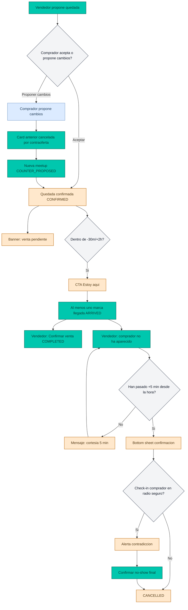

# Flujo de usuario Wallapop Meet (Mermaid)

Este documento fija el user flow oficial de Wallapop Meet para consulta rápida de producto, diseño y desarrollo.

## Happy path (referencia)

Secuencia cerrada: propuesta aceptada, llegada dentro de ventana, cierre de venta por el vendedor.

Reglas clave del happy path:

- `ACCEPT` desde `PROPOSED` solo con rol comprador; desde `COUNTER_PROPOSED`, solo el vendedor acepta la contraoferta.
- `MARK_ARRIVED` habilitado en ventana `scheduledAt - 30 min` hasta `scheduledAt + 2 h`.
- `COMPLETE` solo desde `ARRIVED` y solo con rol vendedor.
- `EXPIRE` cierra la quedada sin repartir culpa entre las partes (no genera `reliabilityImpacts`): desde `PROPOSED`/`COUNTER_PROPOSED` caduca en `scheduledAt` con motivo `PROPOSAL_EXPIRED`; desde `CONFIRMED`/`ARRIVED` caduca al cerrarse la ventana de llegada (`scheduledAt + 2h`) con motivo `MEETUP_EXPIRED`. No aplica desde `COMPLETED`/`CANCELLED` ni antes de la hora de caducidad (`isMeetupExpired`).
- Pago con Wallapop Wallet: al `ACCEPT` una propuesta con `proposedPaymentMethod = WALLET` y precio > 0 se exige `buyerWalletAvailableEur >= finalPrice`; si falta saldo, la card bloquea la aceptación y ofrece abrir `WalletTopUpSheet` para recargar el monedero antes de reintentar. Al aceptar con saldo suficiente se guarda el importe en `walletHoldAmountEur` (el hold), que se limpia al `COMPLETE`, `CANCEL` o `EXPIRE`.
- El comprador solo ve el CTA "Mostrar código QR" en `ARRIVED` si además ha marcado su propia llegada (`arrivalCheckins.BUYER`); el vendedor ve "Escanear código QR" en vez de "Confirmar venta". Ambos CTA disparan el mismo evento `COMPLETE` con rol vendedor: Wallet no crea un estado nuevo, solo cambia la CTA visible.

## Diagrama histórico (no-show y ramas)

Flujo alternativo con reporte de no-show del vendedor (fuera del happy path básico).

